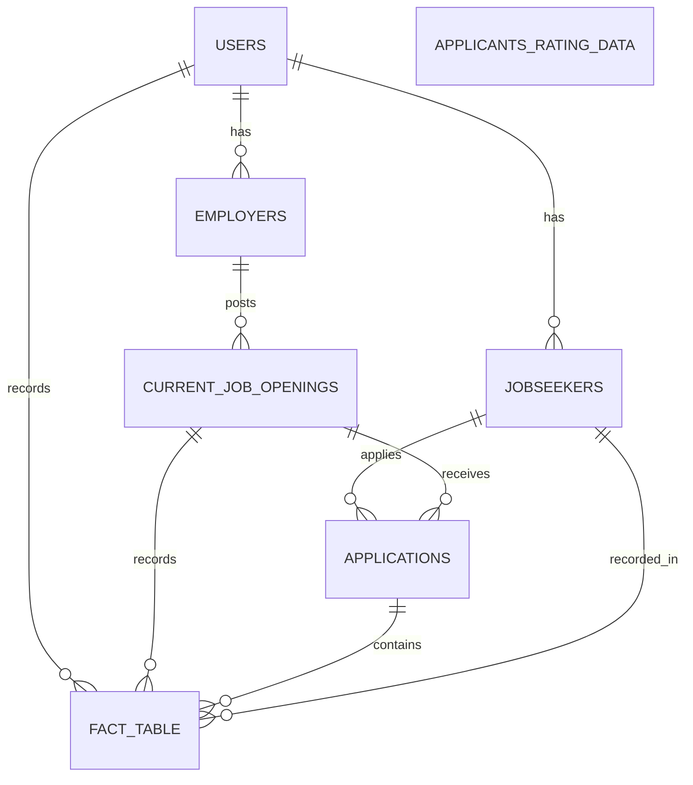

# <p align="center">apna.ai 🤖</p>

<h3 align="center">
  <a href="https://git.io/typing-svg">
    
  </a>
</h3>


### Project Overview

Apna.ai is an ongoing project aimed at revolutionizing the job search experience with cutting-edge AI tools.

### Key Features (Temp UIs for Phase 1)

1. **Resume Ranker**  🚀 [Resume Ranker](https://badal-resume-ranker.streamlit.app/)  
   Author: Badal
   
   Description: Upload your resume and discover your ranking among other applicants for the job.

2. **Resume-AI**  🤖 [Resume-AI](https://chatwithresume.streamlit.app/)  
   Authors: Badal & Yashwanth
   
   Description: Upload your resume and receive AI-generated recommendations and answers to your queries.

3. **Chatbot (under construction)**  🤖 [Chatbot](https://chatbot-lac-ten.vercel.app/)  
   Author: Keerthi & Badal
   
   Description: An interactive chatbot to provide updates on job trends, markets, and other relevant information.

4. **ATS+AI (under construction)**  🤖 Coming Soon

   Author: Akshaya & Badal
   
   Description: An interactive chatbot to provide updates on job trends, markets, and other relevant information.


## 🏗️ Database Architecture




# 🌐 APIs

### ✨ Custom Gemini Response

**Base URL:** [https://gogemini.onrender.com](https://gogemini.onrender.com)
- **Endpoint:** `/generate`
- **HTTP Method:** `POST`
```json
{
    "prompt": "I am Badal"
}
```

### 📈 Resume Rank Calculator

**Base URL:** [https://resume-scorer-fastapi.onrender.com](https://resume-scorer-fastapi.onrender.com)
- **Endpoint:** `/rank`
- **HTTP Method:** `POST`
```json
{
    "score": "7.7"
}
```

### 📝 Resume - Job Description Scorer

**Base URL:** [https://resume-jobdes-scorer.onrender.com](https://resume-scorer-fastapi.onrender.com)
- **Endpoint:** `/similarity`
- **HTTP Method:** `POST`
```json
{
    "string1": "Help me out",
    "string2": "Please, help me out"
}
```

### ⚡ Quick Actions on Applicants Rating Data

**Base URL:** [https://db-crud-fastapi.onrender.com](https://db-crud-fastapi.onrender.com)
- **Endpoint:** `/add_data_to_applicants_rating_data`
- **HTTP Method:** `POST`
```json
{
    "Id": "103"
}
```
- **Endpoint:** `/delete_data_from_applicants_rating_data`
- **HTTP Method:** `DELETE`


- **Endpoint:** `update_data_from_applicants_rating_data/<int:Id>`
- **HTTP Method:** `PUT`
```json
{
    "103": 7.7
}
```
- **Endpoint:** `/get_data_from_applicants_rating_data`
- **HTTP Method:** `GET`

### 🚀 Quick Actions on Current Job Openings Data

**Base URL:** [https://db-crud-fastapi.onrender.com](https://db-crud-fastapi.onrender.com)
- **Endpoint:** `add_data_to_current_job_openings`
- **HTTP Method:** `POST`
```json
{
    "Job_id": "118"
}
```
- **Endpoint:** `/delete_data_from_current_job_openings/<int:id>`
- **HTTP Method:** `DELETE`


- **Endpoint:** `/update_data_from_current_job_openings/<int:id>`
- **HTTP Method:** `POST`
```json
{
    "Name": "Jane Doe"
}
```


- **Endpoint:** `/get_data_from_current_job_openings`
- **HTTP Method:** `GET`
