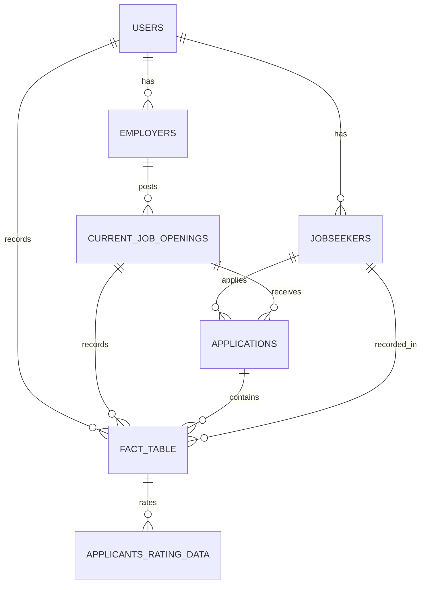

<h3 align="center">
  <a href="https://git.io/typing-svg">
    
  </a>
</h3>


<p align="center" style="font-size:27px; font-weight:bold;">apna.ai 🤖</p>


<p align="center" >
  <a href="https://apnaai-thecloudcodes-projects.vercel.app/" style="font-size:17px; font-weight:bold;">Visit Website</a>
</p>
<!-- <p align="center">
  <a href="https://apna-ai-wsfp.onrender.com/" style="font-size:17px; font-weight:bold;">Visit Backend Server (No Home Page)</a>
</p> -->
<p align="center">
  <a href="#backend-and-apis" style="font-size:17px; font-weight:bold;">Visit Backend & APIs</a>
</p>

<p align="center">
  <a href="#database-architecture" style="font-size:17px; font-weight:bold;">View Database Schema</a>
</p>
<br>

## Project Overview


Apna.ai is an ongoing project aimed at revolutionizing the job search & hiring experience with cutting-edge AI technologies.

### Key Features (Temp UIs for Phase 1)

1. **Resume Ranker**  🚀 [Resume Ranker](https://badal-resume-ranker.streamlit.app/)  
   Author: Badal
   
   Description: Upload your resume and discover your ranking among other applicants for the job.

2. **Resume-AI**  🤖 [Resume-AI](https://chatwithresume.streamlit.app/)  
   Authors: Badal & Yashwanth
   
   Description: Upload your resume and receive AI-generated recommendations and answers to your queries.

3. **Chatbot (under construction)**  🤖 [Chatbot](https://chatbot-lac-ten.vercel.app/)  
   Author: Keerthi & Badal
   
   Description: An interactive chatbot to provide updates on job trends, markets, and other relevant information.

4. **ATS+AI (under construction)**  🤖 Coming Soon

   Author: Akshaya & Badal
   
   Description: An interactive chatbot to provide updates on job trends, markets, and other relevant information.


## Database Architecture




<!-- # Backend

**Base URL:** [https://apna-ai-wsfp.onrender.com/](https://apna-ai-wsfp.onrender.com/) -->

# Backend and APIs

### ✨ Custom Gemini Response

**Base URL:** [https://gogemini.onrender.com](https://gogemini.onrender.com)
- **Endpoint:** `/generate`
- **HTTP Method:** `POST`
```json
{
    "prompt": "I am Badal"
}
```

### 📈 Resume Rank Calculator

**Base URL:** [https://resume-scorer-fastapi.onrender.com](https://resume-scorer-fastapi.onrender.com)
- **Endpoint:** `/rank`
- **HTTP Method:** `POST`
```json
{
    "score": "7.7"
}
```

### 📝 Resume - Job Description Scorer

**Base URL:** [https://resume-jobdes-scorer.onrender.com](https://resume-scorer-fastapi.onrender.com)
- **Endpoint:** `/similarity`
- **HTTP Method:** `POST`
```json
{
    "string1": "Help me out",
    "string2": "Please, help me out"
}
```

### ⚡ Quick Actions on Applicants Rating Data

**Base URL:** [https://db-crud-fastapi.onrender.com](https://db-crud-fastapi.onrender.com)
- **Endpoint:** `/add_data_to_applicants_rating_data`
- **HTTP Method:** `POST`
```json
{
    "Id": "103"
}
```

**Base URL:** [https://db-crud-fastapi.onrender.com](https://db-crud-fastapi.onrender.com)
- **Endpoint:** `/delete_data_from_applicants_rating_data/<int:Id>`
- **HTTP Method:** `DELETE`

**Base URL:** [https://db-crud-fastapi.onrender.com](https://db-crud-fastapi.onrender.com)
- **Endpoint:** `/update_data_from_applicants_rating_data/<int:Id>`
- **HTTP Method:** `PUT`
```json
{
    "Id":1001,
    "Name":"Badal" 
}
```

**Base URL:** [https://db-crud-fastapi.onrender.com](https://db-crud-fastapi.onrender.com)
- **Endpoint:** `/get_data_from_applicants_rating_data`
- **HTTP Method:** `GET`

### 🚀 Quick Actions on Current Job Openings Data

**Base URL:** [https://db-crud-fastapi.onrender.com](https://db-crud-fastapi.onrender.com)
- **Endpoint:** `/add_data_to_current_job_openings`
- **HTTP Method:** `POST`
```json
{
    "Job_id": "118"
}
```

**Base URL:** [https://db-crud-fastapi.onrender.com](https://db-crud-fastapi.onrender.com)
- **Endpoint:** `/delete_data_from_current_job_openings/<int:id>`
- **HTTP Method:** `DELETE`

**Base URL:** [https://db-crud-fastapi.onrender.com](https://db-crud-fastapi.onrender.com)
- **Endpoint:** `/update_data_from_current_job_openings/<int:id>`
- **HTTP Method:** `POST`
```json
{
    "Job_id":117,
    "Company": "belikebadal"
}
```

**Base URL:** [https://db-crud-fastapi.onrender.com](https://db-crud-fastapi.onrender.com)
- **Endpoint:** `/get_data_from_current_job_openings`
- **HTTP Method:** `GET`

<br>

 🌐 **Dedicated Backend Server:** [https://apna-ai-wsfp.onrender.com/](https://apna-ai-wsfp.onrender.com/)
 - **Endpoints** 
    - `'/users', methods=['POST']`
    - `'/users/<int:user_id>', methods=['DELETE']`
    - `'/users/<int:user_id>', methods=['PUT']`
    - `'/upload', methods=['POST']`
    - `'/applications', methods=['POST']`
    - `'/applications', methods=['POST']`
    - `'/applications/<int:application_id>', methods=['DELETE']`
    - `'/applications/<int:application_id>', methods=['PUT']`
    - `'/employers', methods=['POST']`
    - `'/employers/<int:employer_id>', methods=['DELETE']`
    - `'/employers/<int:employer_id>', methods=['PUT']`
    - `'/fact_table', methods=['POST']`
    - `'/fact_table/<int:fact_id>', methods=['DELETE']`
    - `'/fact_table/<int:fact_id>', methods=['PUT']`
    - `'/jobseekers', methods=['POST']`
    - `'/jobseekers/<int:jobseeker_id>', methods=['DELETE']`
    - `'/jobseekers/<int:jobseeker_id>', methods=['PUT']`


## Tech Stack 💻

### Frontend 🎨

- **Next.js**: A React framework for building server-side rendered (SSR) and statically generated web applications. It provides a great developer experience with features like file-based routing, API routes, and built-in support for CSS and TypeScript.

### Backend ⚙️

- **Flask**: A micro web framework for Python based on Werkzeug and Jinja2. It is lightweight and easy to use, making it ideal for building small to medium-sized web applications and APIs.
- **FastAPI**: A modern, fast (high-performance), web framework for building APIs with Python 3.7+ based on standard Python type hints. It is designed for building APIs quickly and efficiently, with automatic interactive documentation.

### Natural Language Processing (NLP) 📚

- **NLP**: The project utilizes various NLP techniques to process and analyze natural language data. This can include tasks like text classification, sentiment analysis, and entity recognition.

### Libraries and Services 📦

- **LangChain**: A library for building language model applications that can chain together multiple steps involving different types of computations or transformations on text.
- **Google Gemini API**: An API provided by Google for accessing advanced language models and NLP tools to enhance the application's language processing capabilities.
- **dotenv**: A module that loads environment variables from a `.env` file into `process.env`. This helps manage configuration and secrets securely.


    

