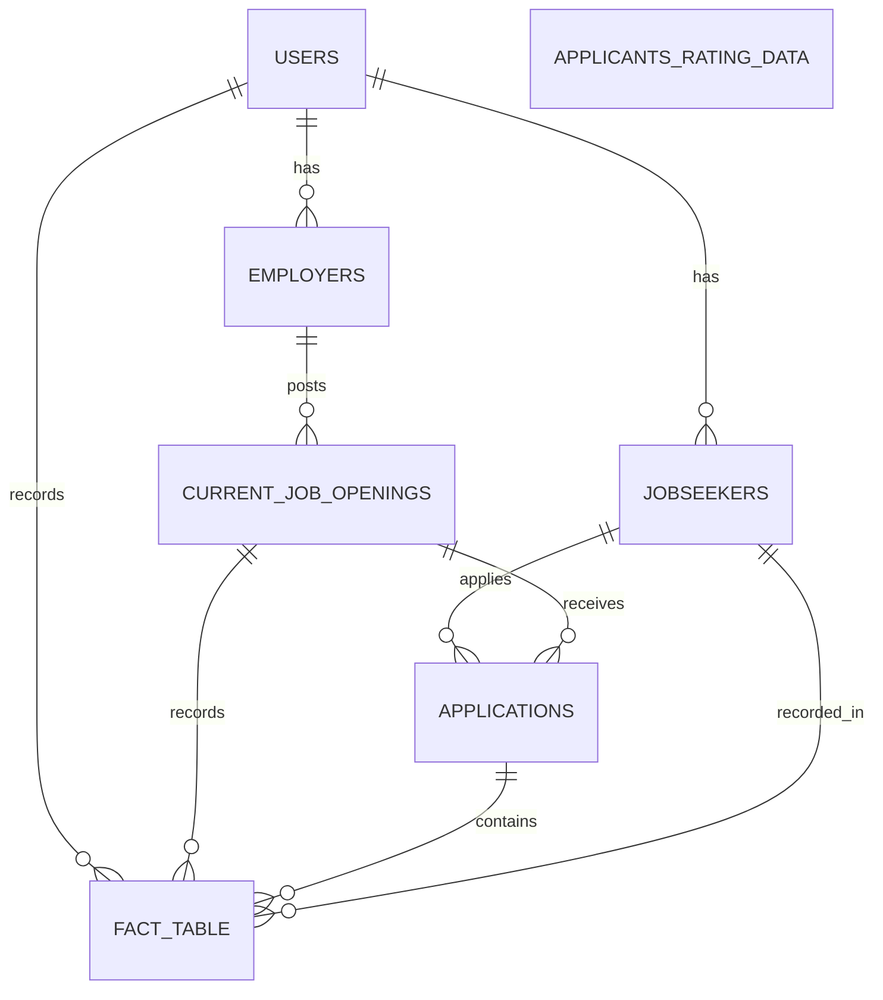

# Apna.ai

Welcome to the Apna.ai project! This repository contains multiple APIs designed to streamline various tasks such as resume scoring, job description matching, and database CRUD operations. Below are the details of the available APIs.

## 🏗️ Database Architecture

## APIs Overview

### Badal

**Resume Scorer**

- **URL**: [https://resume-scorer.onrender.com](https://resume-scorer.onrender.com)
- **Description**: This API takes the resume score, and returns the rank of the resume among all resumes filled in each job application.

### Keerthi

**Gemini Response**

- **URL**: [https://gemini-response.onrender.com](https://gemini-response.onrender.com)
- **Description**: This API provides a response from Gemini on being asked any question regarding hiring, recruitment or placements.

### Yashwanth

**Resume and Job Description Matcher**

- **URL**: [https://resume-jobdescription-scorer.onrender.com](https://resume-jobdescription-scorer.onrender.com)
- **Description**: This API scores and matches a resume with the job description provided by the job description using NLP

### Akshaya

**Database CRUD Operations**

- **URL**: [https://db-crud-nuve.onrender.com](https://db-crud-nuve.onrender.com)
- **Description**: This API performs Create, Read, Update, and Delete operations on a Supabase database, enabling efficient data management.

## Contributors

### Bindu Vamsi

Bindu Vamsi is a core contributor to the Apna.ai project, ensuring the development and maintenance of high-quality APIs.

---

Feel free to reach out if you have any questions or need further assistance with these APIs.
